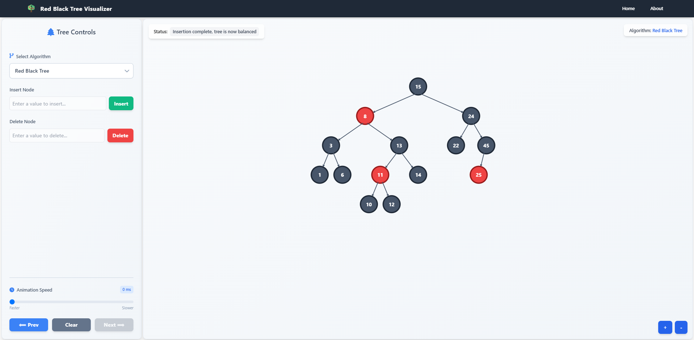

# Red Black Tree Visualizer

A visualizer for red black trees built with dioxus.

## Preview



## Future Improvements

- Add animation for node insertion and deletion
- Include step-by-step updatation of nodes during insertion and deletion
- Support for different tree layouts
- Export tree as image or JSON

## Getting Started

### Tailwind

1. Install bun: Bun: https://bun.sh/docs/installation
2. Install the Tailwind CSS CLI: https://tailwindcss.com/docs/installation
3. Run the following command in the root of the project to start the Tailwind CSS compiler:

```bash
npx tailwindcss -i ./input.css -o ./assets/tailwind.css --watch
```

### Serving Your App

Run the following command in the root of your project to start developing with the default platform:

```bash
dx serve
```

To run for a different platform, use the `--platform platform` flag. E.g.

```bash
dx serve --platform desktop
```
